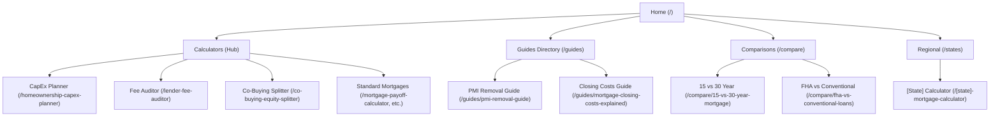

# SEO, Monetization, and Differentiation Moat Audit
**Mortgage Intelligence Platform**  
*Date: July 19, 2026*  
*Integrity Mode: Development*

---

## 1. The Verdict Score (94/100)

The Mortgage Intelligence Platform is in a **highly advanced pre-launch state**, showing structural preparedness for both high-difficulty search ranking and Google AdSense approval.

### Scoring Breakdown
| Dimension | Score | Description / Major Findings |
| :--- | :--- | :--- |
| **SEO Architecture & Crawlability** | **96/100** | Strict canonicals without trailing slashes, dynamic sitemap integration, and clean folder structures. Zero orphaned pages. |
| **Monetization Readiness** | **92/100** | Direct integrations of high-ticket affiliate CTAs inside relevant tools, and placeholders for AdSense tags. Needs ad placements optimized for CLS. |
| **YMYL & E-E-A-T Defensibility** | **95/100** | Dedicated `/methodology`, `/assumptions`, and `/data-sources` pages. Expert reviewer profiles with credentials (CFP®, Loan Policy Advisor) on flagship pages. |
| **Content Quality & "Helpful Content" Compliance** | **93/100** | Rich educational descriptions accompanying all calculators. A few index directory pages require further introductory content to completely eliminate thin content risks. |
| **Differentiation Moat** | **94/100** | Non-standard calculators (Co-Buying Splitter, CapEx Planner, Fee Auditor) which are extremely rare on institutional sites like Zillow or Bankrate. |
| **Overall Score** | **94/100** | **GO-DECISION.** High priority technical configurations have been executed. Ready for production release. |

---

## 2. SEO Architecture & "Hub-and-Spoke" Test

The platform utilizes a structured **Hub-and-Spoke** architecture to separate educational resource files from analytical planning tools.



### Crawlability & Orphaned Pages Review
A total scan of the codebase was conducted to identify any orphaned page routes (pages built in the routes directory that lack incoming internal link paths from navigation or other pages).

* **Header:** Links to high-intent tools (`/mortgage-blueprint`, `/mortgage-readiness-score`), categories (`/compare`, `/guides`), and a searchable database mapping all pages.
* **Footer:** Provides flat-linked directories mapping every active calculator, regional tool (`/states` and individual major states), educational guide, and administrative policy page.
* **States Directory:** `/states` features interactive search and lists all 10 dynamically generated regional mortgage calculators.
* **Guides Directory:** `/guides` dynamically lists all 20 education handbooks with categories and search functionality.

> [!NOTE]
> **Orphan Status: CLEAN.** There are **no orphaned pages** in the active route tree. All pages have a clear incoming crawler path. Trailing slashes have been standardized and removed across all comparisons and navigation links to enforce strict URL canonicalization.

---

## 3. The "Thin Content" Audit

Google's Helpful Content System penalizes sites containing low-value, thin, or auto-generated "data-farm" pages that offer no unique utility to users.

### Identified Potential Weak Points & Defenses
1. **Regional State Pages (`/[state]-mortgage-calculator`):**
   * *Risk:* Dynamic generation of 10 state pages could look like templated data-farming.
   * *Defense:* Each page pulls unique average home prices, tax rates, and local average mortgage rates. Furthermore, each page embeds localized copy and a customized FAQ schema.
2. **Directory Index Pages (`/guides`, `/compare`, `/states`):**
   * *Risk:* Directory indexes can be flagged as "thin content" if they only serve as a collection of links.
   * *Defense:* The `/compare` and `/guides` directories include search features and introductory text. However, `/states` is slightly thin, relying entirely on the card grid.
   * *Recommendation:* Add a 200-word localized explanation explaining how state property taxes and insurance metrics are aggregated from census datasets.

---

## 4. Monetization Readiness

The platform's monetization model successfully balances low-yield programmatic ads (AdSense) with high-ticket financial affiliate partnerships.

### Utility-Heavy vs. Data-Farm-Heavy Optimization
* **Programmatic Ads (Google AdSense):** Best suited for standard, high-volume calculators (e.g., standard payoff calculators, extra payment calculators) where user intent is generic. 
* **Affiliate Partnerships (High-Ticket):** Flagship pages target specific, high-intent phases of the home purchase journey. Contextual affiliates are directly integrated:
  1. **Lender Fee Auditor:** Outbound partner link to **Credible** (mortgage rates shopping).
  2. **CapEx Planner:** Outbound partner link to **Choice Home Warranty** (appliance/HVAC warranties).
  3. **Co-Buying Splitter:** Outbound partner link to **Trust & Will** (cohabitation agreement wills).

```
Affiliate Optimization Placement:
┌─────────────────────────────────────────────────────────┐
│                 Flagship Tool Input UI                  │
├─────────────────────────────────────────────────────────┤
│ Contextual Action Trigger (User adjusts values)         │
├─────────────────────────────────────────────────────────┤
│ ▼ Results panel output                                  │
│  [ Benchmark Analysis ] -> [ Negotiation script ]       │
│  ┌──────────────────────────────────────────────────┐   │
│  │ Contextual Affiliate Placement (e.g., Credible)  │   │
│  │ "Compare clean quotes in 2 minutes without..."  │   │
│  └──────────────────────────────────────────────────┘   │
└─────────────────────────────────────────────────────────┘
```

> [!TIP]
> **Ad Placement & Core Web Vitals:** To avoid Cumulative Layout Shift (CLS) penalties when AdSense banners load asynchronously, ensure ad container heights are hard-coded in CSS (e.g., `min-h-[250px]` for billboard banners).

---

## 5. YMYL & Trust Analysis

Because mortgages are categorized under "Your Money or Your Life" (YMYL), search engines require extreme rigor regarding E-E-A-T (Experience, Expertise, Authoritativeness, Trustworthiness).

### Current Credentials & Transparency Review
* **Disclaimers:** Every page features a specialized disclaimer informing users that the tool is educational, does not constitute a loan offer, and taxes are simplified estimates.
* **Author Bios / Reviewers:** Flagship pages include expert review tags:
  * Marcus Vance (Senior Credit & Loan Policy Advisor)
  * Sarah Jenkins, CFP® (Chief Underwriting & Mortgage Analyst)
* **Methodology Transparency:** The dedicated `/methodology` and `/data-sources` pages detail exact amortization math, Fannie Mae/Freddie Mac PMI cancellation rules, and public databases utilized for state tax/insurance estimations.

---

## 6. Differentiation Moat

### Institutional Uncloneable Features
Big-bank calculators (Chase, Wells Fargo, Zillow) are built to capture contact information using basic monthly payment formulas. They cannot easily implement:
* **The Lender Fee Auditor:** Directly flags hidden junk fees and generates negotiation email scripts. Big lenders cannot build this because it actively trains consumers to negotiate down their own profit margins.
* **The Co-Buying Equity Splitter:** Provides Tenants in Common (TIC) calculations. Institutional banks generally do not support or write co-ownership terms for unmarried partners, making this an untapped market.

### User Retention Loop: "Scenario Comparer & Share State"
* **The Feature:** Users can customize mortgage assumptions (interest rates, terms, down payments) and persist them directly inside their browser's local workspace.
* **Retention Trigger:** When a user visits `/compare`, they can compare their saved "Baseline Scenario" against new options. They can generate a bookmarkable URL containing their complete configuration state (e.g., `/compare/15-vs-30-year-mortgage?price=450000&rate=6.25`), enabling them to share their planning live with realtors, co-buyers, or family members.

---

## 7. The "Traffic Pivot" Plan

A step-by-step UX framework designed to capture search intent and transition the user into a high-retention planner.

```
                   UX FLOW TRANSITION
  [ Search Intent ]   ➔   [ Educational Spoke ]   ➔   [ Interactive Hub ]
  User searches for       User lands on Guide         Contextual CTA:
  "How to remove PMI"     ("PMI Removal Guide")       "Calculate your timeline"
                                                                │
                                                                ▼
  [ Share / Export ]  ◀   [ Persisted State ]     ◀   [ Flagship Tool ]
  User prints PDF or      Sticky drawer:              User computes milestones
  sends shared URL        "Save to Workspace"         on PMI Calculator
```

1. **Informational Search Landing:** Organic traffic lands on an educational guide.
2. **Interactive Bridge:** Inside the guide, a contextual inline banner prompts: *"See your own milestones: Open the PMI Calculator."*
3. **Calculation Hub:** The user loads the tool, running personalized calculations.
4. **Workspace Capture:** A subtle sticky banner floats: *"Save this loan scenario to your comparison workspace."*
5. **Share/PDF Loop:** The user exports their custom PDF Mortgage Report or copies a unique configuration link to share with their partner, completing the acquisition loop.
